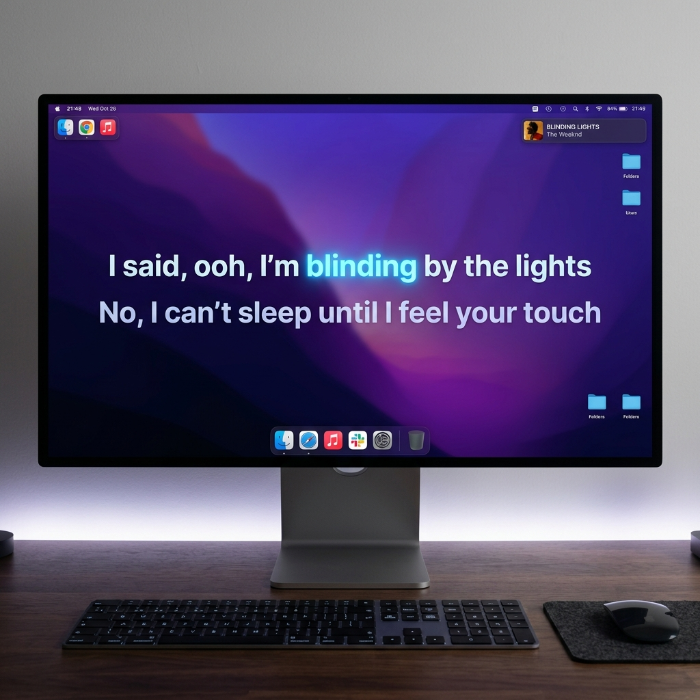
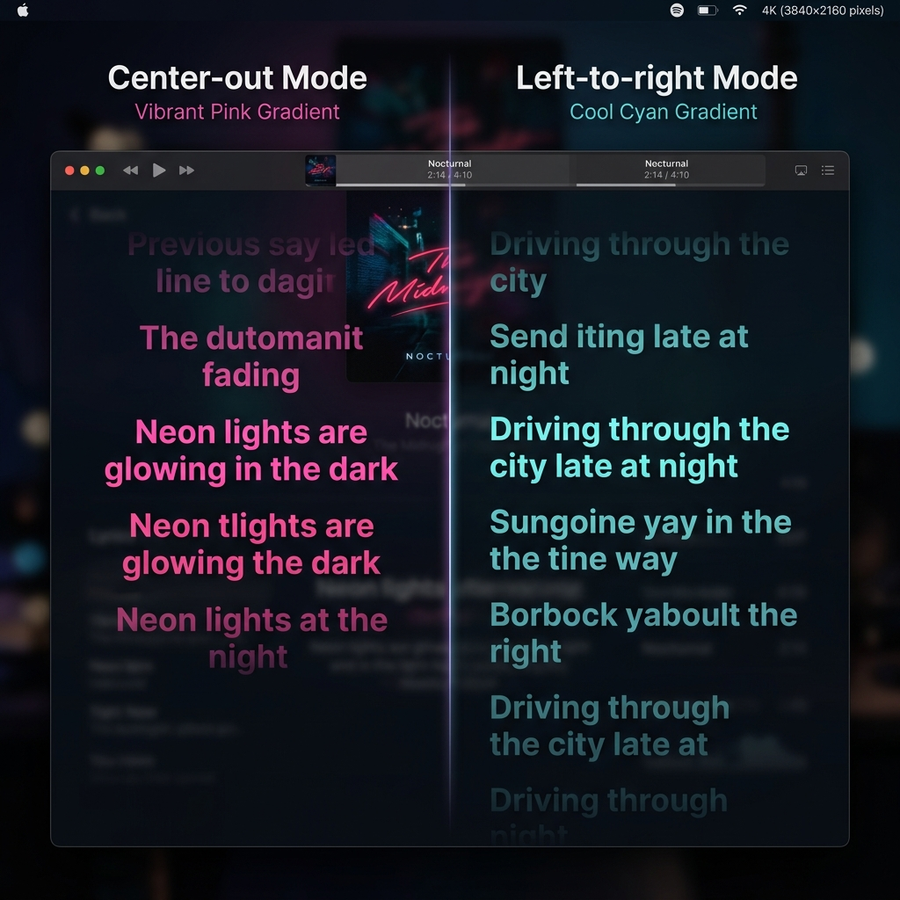

# 灵动岛 (Lingdongdao) 🏝️

> **极致精准的 macOS 卡拉 OK 歌词悬浮窗解决方案**

[](https://developer.apple.com/swift/)
[](https://www.apple.com/macos/)
[](LICENSE)



## ✨ 特性

- **🎯 高精度卡拉 OK 效果**：支持逐字渲染，完美同步音乐律动。
- **🎨 双色动态滚动**：优雅的颜色渐变过渡，支持自定义主题颜色。
- **📐 多种渲染模式**：支持 `居中扩散` 与 `从左至右` 两种主流歌词布局。
- **🌐 智能歌词源**：优先从 **LRCLIB** 获取精准时间轴，并自动合并 **网易云音乐** 的优质翻译。
- **🖥️ 极致体验**：针对 macOS 优化，超低资源占用，支持置顶显示与交互穿透。
- **🎵 多源支持**：完美支持 Apple Music 播放状态监听。

## 🚀 快速开始

### 环境要求
- macOS 13.0 或更高版本
- Xcode 15.0+
- Swift 5.9+

### 安装步骤
```bash
git clone https://github.com/SAKURA1175/lingdongdao.git
cd lingdongdao
open Package.swift
```

## 🛠️ 技术架构

- **核心引擎**：基于 `LyricsLayoutEngine` 的高性能文本渲染。
- **状态管理**：使用 SwiftUI 观察者模式实时响应播放进度。
- **网络层**：并发获取多源歌词，智能比对与合并算法。
- **窗口管理**：原生 AppKit 悬浮窗技术，支持鼠标穿透与视觉聚焦。

## 📸 效果演示

### 核心布局模式

*支持居中扩散与从左至右两种经典卡拉 OK 布局*

---

---

## 📄 开源协议

本项目采用 [MIT License](LICENSE) 开源协议。

---

Made with ❤️ by [SAKURA1175](https://github.com/SAKURA1175)
